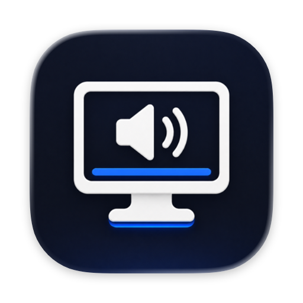
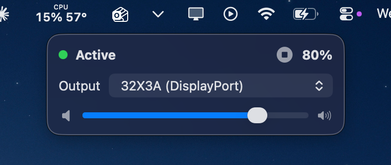
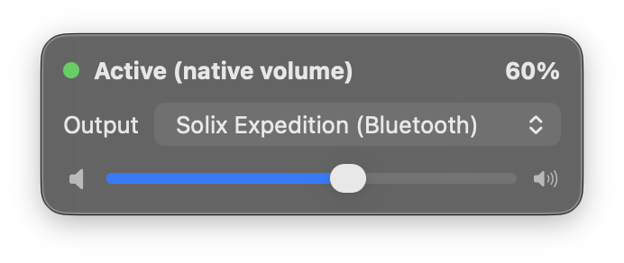
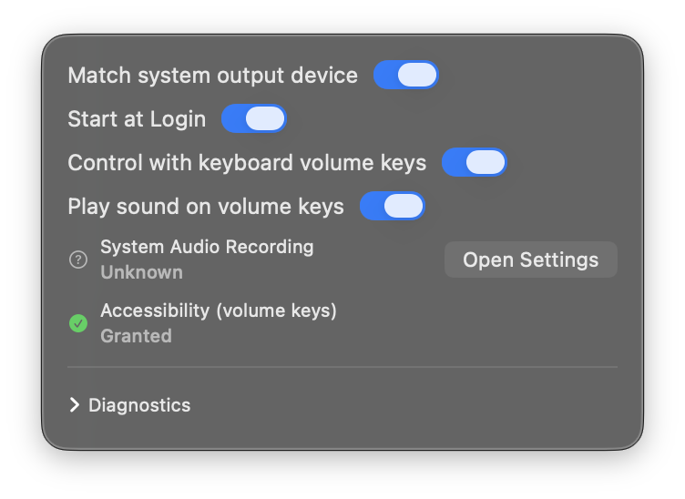
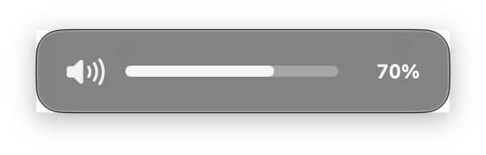

<p align="center">
  
</p>

<h1 align="center">DisplayVolume</h1>

<p align="center">
A lightweight macOS menu-bar app that gives you a working volume control for
<strong>fixed-volume digital audio outputs</strong> — USB-C, DisplayPort, and
HDMI displays whose built-in speakers ignore the Mac's volume keys (for
example a TCL <strong>32X3A</strong> connected over USB-C).
</p>

<p align="center">
  
</p>

macOS can send audio to these displays, but the system volume slider does
nothing, and many of them (including the 32X3A) have broken DDC audio
control (VCP `0x62` fails). DisplayVolume fixes this **entirely in
software**: it captures the audio heading to the display with a Core Audio
**process tap**, applies gain, and plays the processed audio on the same
display.

```
apps & system audio
      │
      ▼
Core Audio process tap  (all processes except DisplayVolume; original
      │                  audio auto-muted only while the tap is read)
      ▼
private aggregate device (invisible to other apps)
      │
      ▼
real-time gain processing (volume curve + click-free ramping)
      │
      ▼
lock-free ring buffer
      │
      ▼
your display's audio output (e.g. "32X3A")
```

No kernel extensions, no virtual audio drivers, no DDC — only Apple's
supported process-tap API
([Capturing system audio with Core Audio taps](https://developer.apple.com/documentation/coreaudio/capturing-system-audio-with-core-audio-taps)).

## How it works

Some monitors accept digital audio at one fixed loudness and provide no way
to change it: macOS's volume slider is grayed out, the volume keys show the
"prohibited" bezel, and DDC audio commands (the protocol used by tools like
Lunar/MonitorControl) are broken on many of them. The only universal fix is
to make the *samples themselves* quieter before they reach the display.

That's what DisplayVolume does. When the active output is a fixed-volume
display, it asks macOS for a **process tap** — the supported API behind
system-audio capture — scoped to exactly that device. Every app's audio that
was headed to the display flows into the tap (macOS mutes the original path
while the tap is read), DisplayVolume scales the samples with a smooth,
click-free gain ramp, and plays the result back on the same display through
a lock-free ring buffer. Total added latency is ~16 ms — irrelevant for
video. Quit the app (or let it crash) and macOS automatically restores the
direct audio path; nothing is ever left muted.

The app deliberately excludes **itself** from the tap (otherwise it would
capture its own playback in a feedback loop), and applies volume with a
perceptual curve where 100 % is bit-exact passthrough — it can never
amplify, clip, or degrade audio at full volume.

**Devices that already have working volume** (built-in speakers, most
headphones and DACs) get the opposite treatment: no tap, no processing —
the slider simply drives the device's real hardware volume, the exact same
control as the system slider, in both directions:

<p align="center">
  
</p>

Left-click the menu-bar icon for the popover above; right-click for a menu
with Start/Stop Processing, Settings…, and Quit. Settings opens as the same
kind of flat panel:

<p align="center">
  
</p>

With keyboard control enabled, the volume keys are handled by DisplayVolume
on every device — software gain on fixed-volume displays, real hardware
volume on native ones — always with the app's own native-style bezel
(below) and an optional macOS-style feedback pop, so the experience is
identical everywhere. Each display remembers its own volume. With keyboard
control off, the keys fall back to standard macOS handling.

<p align="center">
  
</p>

## Features

- Menu-bar app, no Dock icon
- Output-device picker (devices identified by persistent Core Audio UID)
- Two-way sync with the macOS output ("Match system output device", on by
  default): picking a device in the app also switches System Settings →
  Sound, and changing the Mac's output elsewhere retargets the app — the
  tap only captures audio destined for the selected device, so keeping them
  matched is what makes processing work
- Automatic per-device control mode: fixed-volume displays get the software
  tap pipeline; devices with native volume (MacBook speakers, most
  headphones/DACs) are driven through their real hardware volume instead —
  100 % in the app is 100 % in System Settings, changes made elsewhere in
  macOS mirror back into the app, no tap or processing runs, and the
  volume keys pass through to macOS for fully native behavior
- Volume slider 0–100 % with perceptual (quadratic) volume curve
- Mute / unmute, always click-free (10–30 ms gain ramps)
- Optional keyboard volume-key control (mute / down / up, 5 % steps,
  ⌥⇧ for 1 % fine steps) — narrowly scoped to the three sound keys only
- Per-device volume memory: each fixed-volume display remembers its own
  software volume and mute state (native-volume devices are remembered by
  macOS itself)
- Native-style volume HUD overlay whenever the volume keys are used, in
  both control modes, with an optional macOS-style feedback pop
  (correctly attenuated to the current volume even on fixed-volume
  displays)
- Start at Login (`SMAppService`)
- Automatic recovery on display disconnect/reconnect and sleep/wake
- Diagnostics panel with copyable report (device, format, underruns, errors)
- Remembers device, volume, mute, and toggles; first-run volume defaults to
  50 % — it never starts at 100 %

## Privacy

- Audio is processed **locally, in memory only**, and immediately played out.
- Nothing is recorded to disk. Nothing is transmitted. No analytics, no
  crash reporters, no updater, no network access of any kind.
- **No microphone access** — the app captures only system audio output, via
  the user-approved "System Audio Recording" permission.
- Keyboard handling sees **only** the mute/volume-down/volume-up media keys.
  Regular keystrokes are never observed.
- "Copy Diagnostics" copies technical state (versions, device IDs, counters,
  last error) — never audio content.

## Requirements

- macOS 14.2 or newer (built and tested on macOS 26). Apple Silicon is the
  primary platform; Intel builds work.
- To build: either full **Xcode 16+**, or just the **Command Line Tools**
  (Swift 6+) using the provided script.

## Building

### Option A — script (works with Command Line Tools only)

```bash
Scripts/build-app.sh
open build/DisplayVolume.app
```

The script runs `swift build -c release`, assembles
`build/DisplayVolume.app` (Info.plist, PkgInfo, binary), and codesigns it.

**Signing matters for permissions:** macOS ties privacy grants to the code
signature + bundle ID. The default ad-hoc signature (`-`) changes every
build, so macOS will re-ask for System Audio Recording / Accessibility after
each rebuild. For a stable experience sign with a real identity:

```bash
CODESIGN_IDENTITY="Apple Development: Your Name (TEAMID)" Scripts/build-app.sh
```

Keep the bundle identifier (`com.bnewable.DisplayVolume`) stable for the
same reason. Move the app to `/Applications` before granting permissions.

### Option B — Xcode

Open `DisplayVolume.xcodeproj` (Xcode 16 or newer — the project uses
file-system-synchronized groups and links the local Swift package for the
core `DisplayVolumeKit` module). Select your signing team, then Run.

If your Xcode version refuses the project/local-package layout, open
`Package.swift` directly to work on the code, and use Option A to produce
the app bundle.

## Running the tests

```bash
Scripts/run-tests.sh        # wraps `swift test`; adds Swift Testing paths for CLT
```

or with full Xcode installed simply:

```bash
swift test
```

The suite covers the gain processor (silence at 0 %, unity at 100 %, no
amplification, click-free ramps, NaN/∞ safety), the volume curve, the ring
buffer (round-trip, underrun zero-fill, overrun accounting, wrap-around),
and preference persistence. See [docs/MANUAL_TESTS.md](docs/MANUAL_TESTS.md)
for the hardware test checklist.

## Usage

1. Launch DisplayVolume — an icon appears in the menu bar (it shows what
   you're listening on: display, headphones, speaker, …).
2. Left-click it and pick your display in **Output** (it will normally
   appear as `32X3A`; any fixed-volume output works).
3. Press the **▶ button** in the popover header (or right-click the icon →
   **Start Processing**). On first use macOS asks for **System Audio
   Recording** permission (listed under *Privacy & Security → Screen &
   System Audio Recording*). After granting, stop/start once if audio
   hasn't started flowing.
4. Adjust the slider. Right-click → **Settings…** to enable **Control with
   keyboard volume keys** — only then will the app ask for Accessibility
   permission.

While processing is active the original (full-volume) audio path is muted
by the tap's `mutedWhenTapped` behavior, so you only hear the processed
signal. When you stop processing or quit — or if the app crashes — macOS
automatically restores normal direct playback. The system is never left
silent, and no reboot is ever needed.

## Permissions

| Permission | Needed for | Requested when |
|---|---|---|
| System Audio Recording | capturing audio for volume processing | first press of **Start Processing** |
| Accessibility | global volume keys only | enabling **Control with keyboard volume keys** |

Denying a permission never breaks the rest of the app: without System Audio
Recording the app simply cannot process (status shows *Permission
required* with an **Open Settings** button); without Accessibility the
slider and mute button keep working — only the hardware keys don't. The app
never re-prompts on its own.

## Limitations (v1)

- Stereo only (multi-channel devices get stereo on channels 1–2, silence on
  the rest). No surround.
- The tap must run at the device's sample rate; when you change the
  display's sample rate the pipeline rebuilds automatically (~1 s gap).
- Added latency is roughly the ring prefill + one IO buffer
  (≈ 16 ms at 48 kHz by default) — fine for video playback lip-sync.
- No per-app mixing, EQ, DDC/brightness control, recording, or networking —
  deliberately out of scope.
- macOS provides no public API to *query* System Audio Recording permission,
  so the UI reports it as *Unknown* until audio actually flows (then
  *Granted*) or tap creation fails (then *Denied*).
- While processing, the display's own device volume in *System Settings →
  Sound* still does nothing (that is the device's firmware limitation this
  app works around); use the DisplayVolume slider.

## Project layout

```
Package.swift                     SwiftPM manifest (Kit + app + tests)
Sources/CAtomics/                 C11 atomics shim for the real-time path
Sources/DisplayVolumeKit/         core: audio engine, permissions, prefs
  Audio/                          tap, aggregate, ring, gain, pipeline, renderer
  Keyboard/MediaKeyController     narrowly scoped media-key event tap
  Permissions/                    audio-capture + accessibility helpers
  Persistence/Preferences         UserDefaults-backed settings
  Diagnostics/DiagnosticsStore    copyable diagnostics report
  AppState.swift                  main-actor orchestrator / state machine
Sources/DisplayVolumeApp/         SwiftUI menu-bar app (views + @main)
Tests/DisplayVolumeKitTests/      unit tests (Swift Testing)
SupportFiles/                     Info.plist, entitlements
Scripts/                          build-app.sh, run-tests.sh
DisplayVolume.xcodeproj           Xcode project (app target + local package)
docs/MANUAL_TESTS.md              manual hardware test checklist
ARCHITECTURE.md                   audio path + real-time constraints
TROUBLESHOOTING.md                symptom → cause → fix
```

## More documentation

- [ARCHITECTURE.md](ARCHITECTURE.md) — how the audio path works, real-time
  rules, failure-safety design.
- [TROUBLESHOOTING.md](TROUBLESHOOTING.md) — no audio, doubled audio,
  permission loops, crackling, and more.
- [docs/MANUAL_TESTS.md](docs/MANUAL_TESTS.md) — the manual test matrix.
